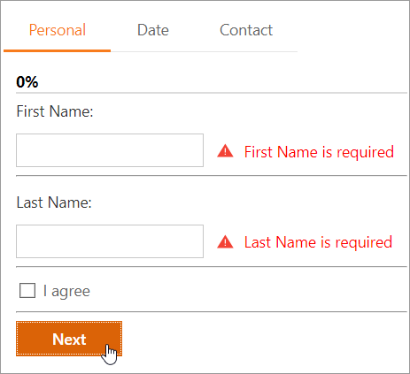

<!-- default badges list -->

<!-- default badges end -->
# Page Control for ASP.NET MVC - How to create a wizard interface

This example demonstrates how to use the [PageControl](https://docs.devexpress.com/AspNetMvc/8970/components/site-navigation-and-layout/pagecontrol?p=netframework) extension to create a wizard interface.

In the example, every wizard step is a [tab page](https://docs.devexpress.com/AspNetMvc/DevExpress.Web.Mvc.MVCxTabPage) that displays multiple fields. Fill in all fields and click the **Next** button at the bottom of the current page to proceed to the next step, or click the **Personal**, **Date**, or **Contact** tab to navigate to the corresponding step.

[Unobtrusive client-side validation](https://docs.devexpress.com/AspNetMvc/12060/components/data-editors-extensions/common-concepts/validation/unobtrusive-client-validation) occurs before you proceed to the next step. Fix all validation errors to move forward.

## Files to Review

* [HomeController.cs](./CS/E3403/Controllers/HomeController.cs)
* [Global.asax](./CS/E3403/Global.asax)
* [Global.asax.cs](./CS/E3403/Global.asax.cs)
* [Account.cs](./CS/E3403/Models/Account.cs)
* [Index.cshtml](./CS/E3403/Views/Home/Index.cshtml)
* [_ContactPartial.cshtml](./CS/E3403/Views/Home/_ContactPartial.cshtml)
* [_DatePartial.cshtml](./CS/E3403/Views/Home/_DatePartial.cshtml)
* [_PersonalPartial.cshtml](./CS/E3403/Views/Home/_PersonalPartial.cshtml)

## Documentation

- [Validation Overview](https://docs.devexpress.com/AspNetMvc/12309/components/data-editors-extensions/common-concepts/validation/validation-overview)

## More Examples

- [Page Control for ASP.NET Web Forms - How to create a wizard interface](https://github.com/DevExpress-Examples/asp-net-web-forms-page-control-create-a-wizard)
